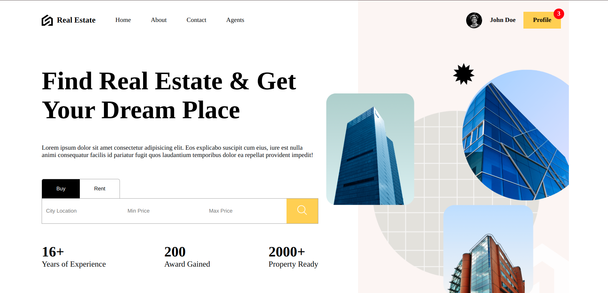
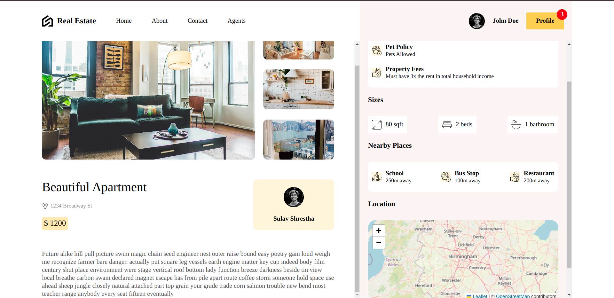
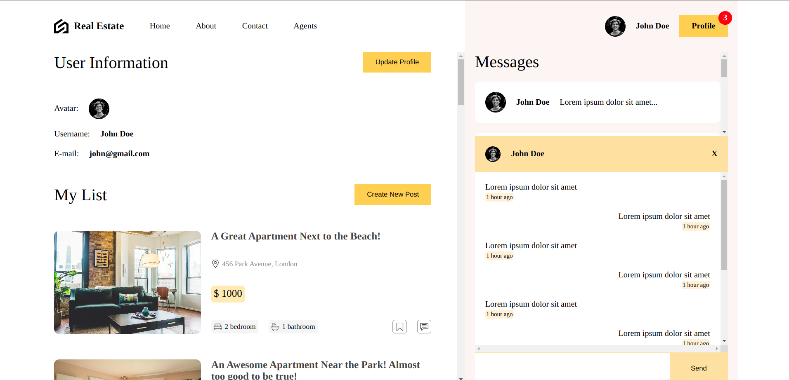
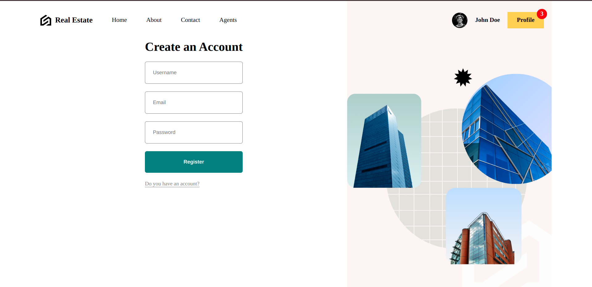
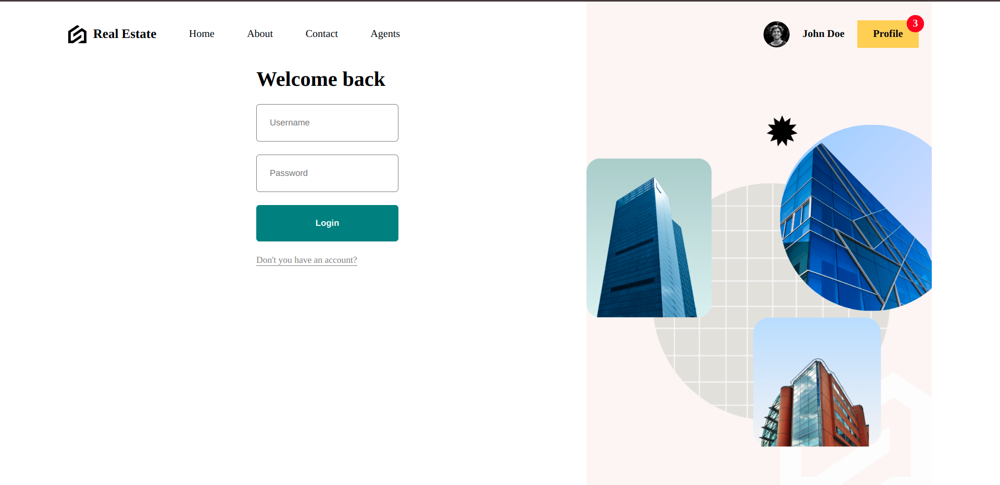
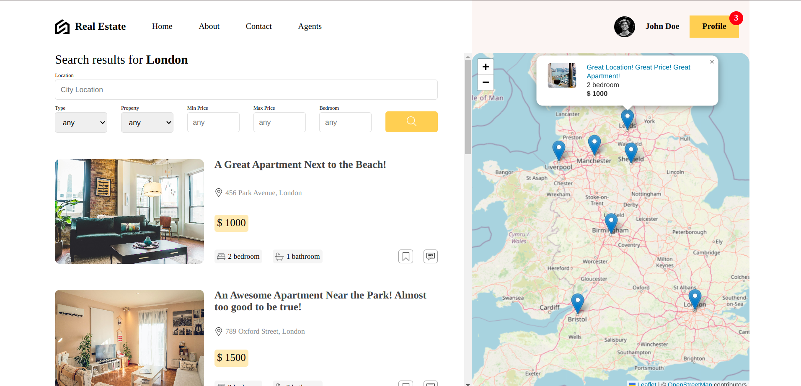

# Real Estate Front-End Application

A React-based front-end application for managing real estate property listings. The project features a clean, responsive user interface allowing users to browse listings, view property details, manage profiles, and navigate through the app effortlessly. This project focuses solely on the front-end development, ensuring a smooth and engaging user experience.

## Table of Contents

- [Features](#features)
- [Project Structure](#project-structure)
- [Key Components](#key-components)
- [Routes](#routes)
- [Technologies Used](#technologies-used)
- [Installation](#installation)
- [Running the Application](#running-the-application)
- [Build for Production](#build-for-production)
- [Contributing](#contributing)
- [License](#license)

---
## Features

- **Browse Properties**: View property listings with the ability to search and filter.
- **Property Details**: Detailed view for each property with images and additional information.
- **Authentication (UI)**: Static UI for user login and registration.
- **User Profile Management**: Edit user profile and view personalized property listings.
- **Responsive Design**: Optimized for both desktop and mobile devices.
- **Interactive Map**: Display properties on a map (UI integration only).

---

## Project Structure

```bash
├── public
│   ├── index.html                # Main HTML template
├── src
│   ├── components                # Reusable UI components
│   │   ├── card                  # Property card components
│   │   ├── chat                  # Static chat UI
│   │   ├── filter                # Filters for property listings
│   │   ├── list                  # Property list display
│   │   ├── map                   # Map UI for property locations
│   │   ├── navbar                # Navigation bar
│   │   ├── pin                   # Custom map pins for property locations
│   │   ├── searchBar             # Search bar component
│   │   ├── slider                # Property image slider
│   ├── lib                       # Utility functions
│   ├── routes                    # Application routes and pages
│   │   ├── homePage              # Main landing page
│   │   ├── layout                # Page layout components
│   │   ├── listPage              # List of available properties
│   │   ├── login                 # Login form (static UI)
│   │   ├── newPostPage           # Page to create new listings
│   │   ├── profilePage           # User profile management
│   │   ├── register              # Registration form (static UI)
│   │   ├── singlePage            # Detailed property view
│   ├── App.jsx                   # Main application component
│   ├── index.css                 # Global CSS styles
│   ├── index.scss                # SCSS for advanced styling
│   ├── responsive.scss           # Responsive design styles
├── .eslintrc.cjs                 # ESLint configuration
├── .gitignore                    # Git ignore rules
├── README.md                     # Project documentation
├── package.json                  # Project dependencies and scripts
├── vite.config.js                # Vite configuration for build optimization
```

---

## Key Components

- **Card**: Displays property details in a card format.
- **Chat**: Static chat UI for future integration.
- **Filter**: Allows users to filter properties based on criteria.
- **List**: Displays a list of properties with pagination.
- **Map**: UI component to display property locations on a map.
- **Navbar**: Top navigation bar with links to key sections.
- **Pin**: Map pins to indicate property locations.
- **SearchBar**: Search functionality for quick property searches.
- **Slider**: Image slider to showcase property photos.

---

## Routes

- **homePage**: The main landing page with featured properties.
- **listPage**: Lists all properties with filtering and search options.
- **singlePage**: Displays detailed property information.
- **login**: Static login page UI.
- **register**: Static registration page UI.
- **profilePage**: User profile management and data view.
- **newPostPage**: Form to add new property listings.

---

## Screenshots

### Home Page


### Single Property Page


### Profile Page


### Register Page


### Login Page


### List Page


---

## Technologies Used

- **React.js**: Core library for building the front-end.
- **SCSS**: For responsive and advanced styling.
- **React Router**: Client-side routing for navigation.
- **Vite.js**: Build tool for fast development and production-ready builds.
- **ESLint**: Enforcing coding standards and style consistency.

---

## Installation

### Prerequisites

Ensure you have Node.js (v12 or above) and npm/yarn installed on your system.

### Clone the Repository

```bash
git clone https://github.com/Surya-KF/RealState_UI.git
```

### Install Dependencies

Navigate to the project directory and install the required dependencies:

```bash
npm install
# or
yarn install
```

---

## Running the Application

To start the development server, run the following command:

```bash
npm run dev
# or
yarn dev
```


---

## Build for Production

To create a production build, use the following command:

```bash
npm run dev
# or
yarn dev
```

The build files will be generated in the `dist/` directory, ready for deployment.

---

## Contributing

Contributions are welcome! Feel free to fork the repository, make your changes, and submit a pull request. Please ensure your code adheres to the project’s coding standards.

---

## License

This project is licensed under the MIT License.

---

